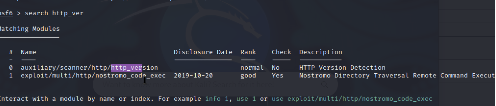

# Understanding HTTP Security: A Practical Guide

## Introduction to Port 80 Vulnerabilities

This guide demonstrates how to identify and understand vulnerabilities in HTTP services running on Port 80. This knowledge is essential for system administrators and security professionals to better protect their systems.

## Why Focus on Port 80?

HTTP (Hypertext Transfer Protocol) running on Port 80 is a fundamental protocol for web services. We focus on it because:

* It's commonly used for web traffic
* It transmits data in plaintext, making it easier to analyze
* Many legacy systems still use HTTP instead of HTTPS
* It's often a starting point for security assessments

## Required Tools

1. Metasploitable - A purposely vulnerable virtual machine for security testing
3. Kali Linux - Security-focused Linux distribution containing:
   * Nmap - Network scanning and reconnaissance tool
   * Metasploit Framework (MSF)
4. Web browser - For verifying findings

## Technical Breakdown

### Step 1: Initial Reconnaissance with Nmap

Command used: `nmap -sV [IP] -p80`

Let's break down this command:
* `-sV`: Performs version detection of services
* `-p80`: Specifically targets port 80
* This scan identifies:
   * Running web server software
   * Version information
   * Operating system details

### Step 2: Service Enumeration
1. Launch Metasploit Framework
`msfconsole`

2. Search for HTTP information gathering module
`search http_version`

4. Select the HTTP version scanner
`use auxiliary/scanner/http/http_version`

5. View available options
`show options`

6. Set your target IP
`set RHOSTS [TARGET_IP]`

7. Execute the scan
`run`

**Note: Run the scan to gather detailed information about what services and applications are running on this port. This reconnaissance step will help identify the specific technologies and versions being used by the target web server. Once we have this information, we can better understand what potential vulnerabilities or misconfigurations might exist and determine our next steps for enumeration.**

### Step 2a: Understand the Information Given
The codeblock that was returned to us provides a lot of information in one single line. Every single one of the returned components is important. In some way, they are all succeptible to manipulation and exploitation. I will provide a better breakdown of how. 

**Apache/2.28** - This is the Apache web server software, version 2.28
  * Web server vulnerabilities like remote code execution
    
**(Ubuntu)** - The server is running on Ubuntu Linux distribution
  * OS-level vulnerabilities (kernel exploits, privilege escalation)
    
**DAV/2** - WebDAV (Web Distributed Authoring and Versioning) version 2 is enabled, which allows file management over HTTP
  * File manipulation vulnerabilities, directory traversal
    
**Powered by PHP/5.2.4-2 ubuntu5.10*** - The server is running PHP version 5.2.4-2, specifically the Ubuntu package version 5.10
  * Most critical due to age: Remote code execution, SQL injection, File inclusion vulnerabilities, Memory corruption issues

**Out of all these options - the PHP one seems the most attractive. It extremely only (15 years) and has multiple access points. There is also a lot of open source information that we can find online to help us accomplish this.**

### Step 3: Directory Structure Analysis
The next thing that we are going to do is ensure that PHP is running an possibly see some of the other protocols running on out Port 80 (HTTP).

A directory scanner (dir_scanner) actively probes for hidden directories and files on a web server, while HTTP version detection just identifies server software versions. Here's the reformatted command sequence:

1. Launch Metasploit Framework `msfconsole`

2. Search for directory scanning module `search dir_scanner`

3. View scanner options `show options`

4. Configure target `set RHOSTS [IP]`

5. Execute scan `run`
   

### Step 4: Clarify Objective
We want access to the backend of the HTTP server. Here is the visualization of the front-end.

